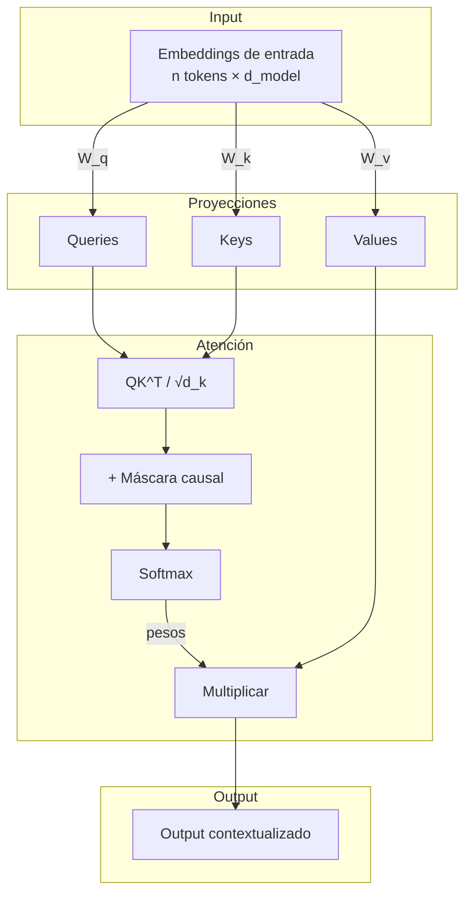

# Arquitectura Transformer y Mecanismo de Atención

**Tiempo estimado**: 45 minutos
**Nivel**: Básico
**Prerrequisitos**: Álgebra lineal básica (multiplicación de matrices), conceptos de redes neuronales

## ¿Por qué importa este concepto?

Los Transformers son la arquitectura fundamental detrás de todos los modelos de lenguaje modernos, incluyendo Gemini, GPT, Claude y LLaMA. Entender cómo funcionan te permite comprender por qué los modelos tienen ciertas limitaciones (como el límite de contexto), cómo optimizar tus prompts, y por qué técnicas como Chain of Thought funcionan.

Antes de los Transformers (2017), los modelos de secuencia usaban RNNs y LSTMs que procesaban tokens uno por uno, creando cuellos de botella en secuencias largas. El Transformer revolucionó el campo al procesar todos los tokens simultáneamente mediante el mecanismo de atención.

## Conexión con conocimientos previos

Si has trabajado con redes neuronales tradicionales (feedforward o convolucionales), ya conoces el concepto de capas que transforman inputs en outputs. El Transformer es una arquitectura específica que reemplaza las operaciones secuenciales por operaciones paralelas basadas en "atención", permitiendo que cada posición del input "mire" a todas las demás posiciones.

---

## Comprensión intuitiva

Imagina que estás leyendo la frase: "El gato se sentó en el tapete porque estaba cansado". Cuando lees "estaba", tu cerebro automáticamente busca a qué se refiere: ¿el gato o el tapete? Inmediatamente entiendes que es "el gato" porque tiene sentido semánticamente.

El mecanismo de atención hace exactamente esto: para cada palabra, calcula qué tan "relevantes" son todas las demás palabras para entender su significado en contexto. Es como si cada palabra preguntara: "¿A quién debo prestar atención para entender mi rol en esta oración?"

### Ejemplo motivador

Considera dos oraciones:
1. "El banco está cerrado" (institución financiera)
2. "Me senté en el banco" (mueble)

La palabra "banco" tiene significados completamente diferentes. Un modelo sin atención trataría "banco" igual en ambos casos. Con atención, el modelo "mira" las palabras circundantes ("cerrado" vs "senté") para determinar el significado correcto. Esta capacidad de contextualización dinámica es el superpoder de los Transformers.

---

## Definición formal

### La arquitectura Transformer

Un Transformer consiste en dos componentes principales:
- **Encoder**: Procesa la secuencia de entrada y genera representaciones contextuales
- **Decoder**: Genera la secuencia de salida token por token

Para modelos de lenguaje como Gemini, típicamente solo se usa el **Decoder** (arquitectura decoder-only), ya que la tarea es predecir el siguiente token dada una secuencia.

### El mecanismo de Self-Attention

Dado un input de `n` tokens, cada token se representa como un vector de dimensión `d_model`. La atención calcula tres vectores para cada token:

- **Query (Q)**: "¿Qué estoy buscando?"
- **Key (K)**: "¿Qué información tengo?"
- **Value (V)**: "¿Qué información proporciono si me seleccionan?"

La fórmula de Scaled Dot-Product Attention es:

```
Attention(Q, K, V) = softmax(QK^T / √d_k) × V
```

Donde:
- `QK^T` calcula la similitud entre cada par de tokens
- `√d_k` es un factor de escala para estabilizar gradientes
- `softmax` normaliza los scores en probabilidades
- La multiplicación final pondera los values según la atención

### Multi-Head Attention

En lugar de una única atención, los Transformers usan múltiples "cabezas" de atención en paralelo:

```
MultiHead(Q, K, V) = Concat(head_1, ..., head_h) × W^O

donde head_i = Attention(QW_i^Q, KW_i^K, VW_i^V)
```

Cada cabeza aprende a prestar atención a diferentes tipos de relaciones (sintácticas, semánticas, posicionales, etc.).

### Propiedades fundamentales

1. **Paralelización**: Todos los tokens se procesan simultáneamente, no secuencialmente
2. **Atención global**: Cada token puede atender a cualquier otro token directamente
3. **Complejidad cuadrática**: El costo computacional es O(n²) respecto a la longitud de secuencia
4. **Permutation equivariant**: Sin embeddings posicionales, el orden no afectaría el resultado

---

## Implementación práctica

### Pseudocódigo de Self-Attention

```
función self_attention(X, W_q, W_k, W_v):
    # X: matriz de entrada [n_tokens, d_model]

    Q = X @ W_q  # Queries: [n_tokens, d_k]
    K = X @ W_k  # Keys: [n_tokens, d_k]
    V = X @ W_v  # Values: [n_tokens, d_v]

    # Calcular scores de atención
    scores = Q @ K.T / sqrt(d_k)  # [n_tokens, n_tokens]

    # Aplicar máscara causal (para decoder)
    scores = aplicar_mascara_causal(scores)

    # Normalizar con softmax
    attention_weights = softmax(scores, dim=-1)

    # Ponderar values
    output = attention_weights @ V

    return output
```

### Implementación en Python

```python
import numpy as np
from typing import Optional

def scaled_dot_product_attention(
    Q: np.ndarray,
    K: np.ndarray,
    V: np.ndarray,
    mask: Optional[np.ndarray] = None
) -> tuple[np.ndarray, np.ndarray]:
    """
    Calcula Scaled Dot-Product Attention.

    Args:
        Q: Queries con shape [batch, n_heads, seq_len, d_k]
        K: Keys con shape [batch, n_heads, seq_len, d_k]
        V: Values con shape [batch, n_heads, seq_len, d_v]
        mask: Máscara opcional para atención causal

    Returns:
        output: Resultado de atención [batch, n_heads, seq_len, d_v]
        attention_weights: Pesos de atención [batch, n_heads, seq_len, seq_len]
    """
    d_k = Q.shape[-1]

    # Calcular scores: Q @ K^T
    # Shape: [batch, n_heads, seq_len, seq_len]
    scores = np.matmul(Q, K.transpose(0, 1, 3, 2))

    # Escalar por sqrt(d_k) para estabilidad numérica
    scores = scores / np.sqrt(d_k)

    # Aplicar máscara si existe (para atención causal)
    if mask is not None:
        # Usar valor muy negativo donde mask=0 para que softmax lo ignore
        scores = np.where(mask == 0, -1e9, scores)

    # Softmax sobre la última dimensión (keys)
    def softmax(x, axis=-1):
        exp_x = np.exp(x - np.max(x, axis=axis, keepdims=True))
        return exp_x / np.sum(exp_x, axis=axis, keepdims=True)

    attention_weights = softmax(scores)

    # Multiplicar por Values
    output = np.matmul(attention_weights, V)

    return output, attention_weights


def create_causal_mask(seq_len: int) -> np.ndarray:
    """
    Crea máscara causal para que cada posición solo atienda
    a posiciones anteriores (incluyéndose a sí misma).

    Args:
        seq_len: Longitud de la secuencia

    Returns:
        mask: Matriz triangular inferior [seq_len, seq_len]
    """
    # Matriz triangular inferior: 1s abajo de la diagonal, 0s arriba
    mask = np.tril(np.ones((seq_len, seq_len)))
    return mask


class MultiHeadAttention:
    """
    Implementación de Multi-Head Attention.
    """

    def __init__(self, d_model: int, n_heads: int):
        """
        Args:
            d_model: Dimensión del modelo
            n_heads: Número de cabezas de atención
        """
        assert d_model % n_heads == 0, "d_model debe ser divisible por n_heads"

        self.d_model = d_model
        self.n_heads = n_heads
        self.d_k = d_model // n_heads

        # Inicializar pesos (normalmente con Xavier/He initialization)
        scale = np.sqrt(2.0 / d_model)
        self.W_q = np.random.randn(d_model, d_model) * scale
        self.W_k = np.random.randn(d_model, d_model) * scale
        self.W_v = np.random.randn(d_model, d_model) * scale
        self.W_o = np.random.randn(d_model, d_model) * scale

    def split_heads(self, x: np.ndarray) -> np.ndarray:
        """Divide la última dimensión en (n_heads, d_k)."""
        batch_size, seq_len, _ = x.shape
        x = x.reshape(batch_size, seq_len, self.n_heads, self.d_k)
        # Transponer a [batch, n_heads, seq_len, d_k]
        return x.transpose(0, 2, 1, 3)

    def combine_heads(self, x: np.ndarray) -> np.ndarray:
        """Combina las cabezas de vuelta a [batch, seq_len, d_model]."""
        batch_size, _, seq_len, _ = x.shape
        x = x.transpose(0, 2, 1, 3)  # [batch, seq_len, n_heads, d_k]
        return x.reshape(batch_size, seq_len, self.d_model)

    def forward(
        self,
        x: np.ndarray,
        mask: Optional[np.ndarray] = None
    ) -> np.ndarray:
        """
        Forward pass de Multi-Head Attention.

        Args:
            x: Input [batch, seq_len, d_model]
            mask: Máscara causal opcional

        Returns:
            output: [batch, seq_len, d_model]
        """
        # Proyectar a Q, K, V
        Q = x @ self.W_q
        K = x @ self.W_k
        V = x @ self.W_v

        # Dividir en múltiples cabezas
        Q = self.split_heads(Q)
        K = self.split_heads(K)
        V = self.split_heads(V)

        # Aplicar atención
        if mask is not None:
            # Expandir máscara para batch y heads
            mask = mask[np.newaxis, np.newaxis, :, :]

        attn_output, _ = scaled_dot_product_attention(Q, K, V, mask)

        # Combinar cabezas
        concat_output = self.combine_heads(attn_output)

        # Proyección final
        output = concat_output @ self.W_o

        return output
```

### Casos de prueba

```python
# Test 1: Verificar dimensiones de salida
print("Test 1: Verificar dimensiones")
batch_size, seq_len, d_model, n_heads = 2, 10, 64, 8

mha = MultiHeadAttention(d_model, n_heads)
x = np.random.randn(batch_size, seq_len, d_model)

output = mha.forward(x)
assert output.shape == (batch_size, seq_len, d_model), \
    f"Shape incorrecto: {output.shape}"
print(f"✓ Output shape correcto: {output.shape}")

# Test 2: Atención causal (cada posición solo ve anteriores)
print("\nTest 2: Máscara causal")
mask = create_causal_mask(seq_len)
output_masked = mha.forward(x, mask)
assert output_masked.shape == (batch_size, seq_len, d_model)
print(f"✓ Máscara causal aplicada correctamente")

# Test 3: Self-attention básica produce probabilidades válidas
print("\nTest 3: Pesos de atención suman 1")
Q = np.random.randn(1, 1, 5, 8)  # batch=1, heads=1, seq=5, d_k=8
K = np.random.randn(1, 1, 5, 8)
V = np.random.randn(1, 1, 5, 8)

_, weights = scaled_dot_product_attention(Q, K, V)
row_sums = weights.sum(axis=-1)
assert np.allclose(row_sums, 1.0), f"Filas no suman 1: {row_sums}"
print(f"✓ Pesos de atención son distribuciones válidas")

print("\n✅ Todos los tests pasaron")
```

### Análisis de complejidad

**Temporal**: O(n² × d) donde n es la longitud de secuencia y d es la dimensión del modelo
- La multiplicación QK^T es O(n² × d_k)
- La multiplicación con V es O(n² × d_v)
- Para n grande, esto domina el costo total

**Espacial**: O(n² + n × d)
- La matriz de atención QK^T requiere O(n²) memoria
- Este es el cuello de botella principal para secuencias largas
- Por esto los modelos tienen límites de contexto (ej: 32K, 128K tokens)

---

## Variantes del mecanismo de atención

### Variante 1: Flash Attention
Optimización que reduce el uso de memoria de O(n²) a O(n) mediante tiling y recomputación inteligente. No cambia la matemática, solo la implementación a nivel de GPU.

**Cuándo usarla**: Siempre que esté disponible en tu framework (PyTorch 2.0+, JAX)

### Variante 2: Sparse Attention
En lugar de que cada token atienda a todos, define patrones de atención sparse (local + global). Reduce complejidad a O(n × √n) o O(n × log n).

**Cuándo usarla**: Secuencias muy largas (>10K tokens) donde atención completa es prohibitiva

### Variante 3: Linear Attention
Reordena el cálculo para evitar la matriz n×n explícita. Complejidad O(n × d²).

**Cuándo usarla**: Cuando d << n (modelos con dimensiones pequeñas y secuencias largas)

---

## Errores frecuentes

### Error 1: Olvidar escalar por √d_k

```python
# INCORRECTO - scores pueden explotar
def bad_attention(Q, K, V):
    scores = Q @ K.T  # Sin escalar
    weights = softmax(scores)
    return weights @ V
```

**Por qué falla**: Sin el factor 1/√d_k, los productos punto pueden ser muy grandes, causando que softmax produzca distribuciones casi one-hot (un valor ~1, resto ~0). Esto destruye los gradientes durante entrenamiento.

### Solución correcta

```python
# CORRECTO - escalado apropiado
def good_attention(Q, K, V):
    d_k = Q.shape[-1]
    scores = Q @ K.T / np.sqrt(d_k)  # Escalado
    weights = softmax(scores)
    return weights @ V
```

### Error 2: Máscara causal incorrecta

```python
# INCORRECTO - permite ver el futuro
def bad_causal_mask(seq_len):
    return np.ones((seq_len, seq_len))  # Todo visible
```

**Por qué falla**: En generación autoregresiva, el modelo no debe ver tokens futuros. Sin máscara causal, el modelo puede "hacer trampa" durante entrenamiento.

### Solución correcta

```python
# CORRECTO - triangular inferior
def good_causal_mask(seq_len):
    return np.tril(np.ones((seq_len, seq_len)))
```

### Error 3: Aplicar máscara después de softmax

```python
# INCORRECTO - orden equivocado
def bad_masked_attention(Q, K, V, mask):
    scores = Q @ K.T / np.sqrt(Q.shape[-1])
    weights = softmax(scores)
    weights = weights * mask  # Máscara DESPUÉS de softmax
    return weights @ V
```

**Por qué falla**: Los pesos ya no sumarán 1 después de aplicar la máscara, rompiendo la interpretación probabilística.

---

## Visualización del concepto



### Visualización de matriz de atención

Para la frase "El gato come pescado":

```
         El   gato  come  pescado
El      [0.7   0.1   0.1   0.1  ]
gato    [0.3   0.5   0.1   0.1  ]
come    [0.1   0.4   0.3   0.2  ]
pescado [0.1   0.2   0.3   0.4  ]

Cada fila suma 1.0 (softmax)
Valores altos = alta atención entre tokens
```

---

## Casos de uso en producción

### Aplicación 1: Modelos de lenguaje (Gemini, GPT)
**Contexto**: Generación de texto autoregresivo
**Solución**: Decoder-only Transformer con atención causal
**Escala**: Modelos con 70B-1T parámetros, contextos de 32K-1M tokens

### Aplicación 2: Traducción automática
**Contexto**: Convertir texto de un idioma a otro
**Solución**: Encoder-Decoder Transformer (el encoder procesa el idioma fuente, el decoder genera el idioma destino con cross-attention al encoder)
**Escala**: Google Translate procesa miles de millones de consultas diarias

### Aplicación 3: Vision Transformers (ViT)
**Contexto**: Clasificación y análisis de imágenes
**Solución**: Dividir imagen en patches, tratar cada patch como un "token"
**Escala**: Gemini Pro Vision usa Transformers para procesar imágenes junto con texto

---

## ¿Cuándo usar este enfoque?

| Escenario | Transformer | RNN/LSTM | CNN |
|-----------|-------------|----------|-----|
| Secuencias largas | ✓ Paralelo | ❌ Secuencial | ❌ Receptivo limitado |
| Dependencias largas | ✓ Atención directa | ❌ Gradiente se desvanece | ❌ Requiere profundidad |
| Entrenamiento | ✓ Muy paralelizable | ❌ Difícil de paralelizar | ✓ Paralelizable |
| Interpretabilidad | ✓ Pesos de atención | ❌ Estado oculto | ❌ Filtros abstractos |

**Regla de decisión**: Para cualquier tarea de secuencias moderna (texto, código, audio, video), los Transformers son el punto de partida por defecto.

---

## Para ir más allá

### Papers fundamentales

1. Vaswani et al., 2017 - "Attention Is All You Need" - El paper original que introdujo el Transformer
2. Devlin et al., 2018 - "BERT" - Demostró el poder de preentrenamiento bidireccional
3. Brown et al., 2020 - "GPT-3" - Escalado masivo y few-shot learning

### Implementaciones de referencia

- **HuggingFace Transformers**: Implementaciones optimizadas de todos los modelos populares
- **JAX/Flax**: Implementaciones de Google para TPUs
- **FlashAttention**: Optimización de memoria a nivel de kernel

### Preguntas abiertas en investigación

- **Contexto infinito**: ¿Cómo manejar secuencias de millones de tokens eficientemente?
- **Razonamiento**: ¿Pueden los Transformers hacer razonamiento simbólico verdadero?
- **Eficiencia**: ¿Cómo reducir el costo cuadrático sin perder calidad?

---

## Resumen del concepto

**En una frase**: El Transformer procesa secuencias usando atención, permitiendo que cada token "mire" a todos los demás para entender su contexto.

**Cuándo usarlo**: Para cualquier tarea de modelado de secuencias (texto, código, audio, imágenes).

**Complejidad**: Tiempo O(n²d) | Espacio O(n² + nd)

**Prerequisito crítico**: Entender multiplicación de matrices y el concepto de representaciones vectoriales.

**Siguiente paso**: Módulo 0.1.2 - Modelos de Lenguaje y Generación de Texto, donde veremos cómo los Transformers se entrenan para predecir el siguiente token.
