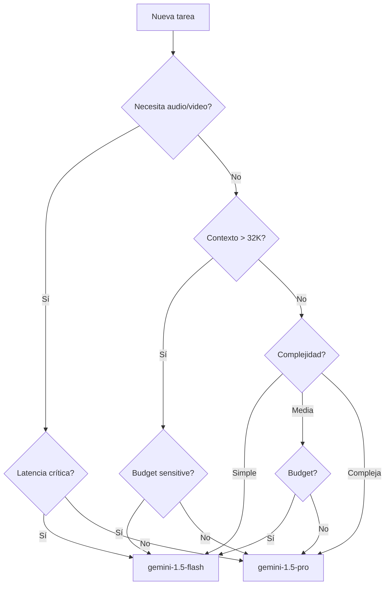

# Familia de Modelos Gemini

**Tiempo estimado**: 30 minutos
**Nivel**: Básico
**Prerrequisitos**: Arquitectura Transformer (0.1.1), Generación de texto (0.1.2)

## ¿Por qué importa este concepto?

Gemini es la familia de modelos de IA de Google que usaremos a lo largo del curso para construir agentes. Conocer las diferentes variantes, sus capacidades y limitaciones te permite elegir el modelo adecuado para cada tarea, optimizar costos, y entender qué es posible lograr.

A diferencia de modelos anteriores, Gemini es **nativo multimodal**: fue entrenado desde el inicio para procesar texto, imágenes, audio y video de manera integrada, no como capacidades añadidas posteriormente.

## Conexión con conocimientos previos

Vimos cómo funcionan los Transformers y la generación de texto. Gemini usa estas mismas bases pero con arquitecturas específicas optimizadas por Google, entrenadas en cantidades masivas de datos multimodales.

---

## Comprensión intuitiva

Piensa en Gemini como una familia de "cerebros" de diferentes tamaños y especialidades:

- **Gemini Ultra/1.5 Pro**: El "experto senior" - más capaz, más caro, para tareas complejas
- **Gemini Pro**: El "profesional" - balance entre capacidad y costo
- **Gemini Flash**: El "asistente rápido" - optimizado para velocidad y costo
- **Gemini Nano**: El "dispositivo local" - corre en teléfonos sin internet

Cada uno tiene su lugar: no usarías un experto senior para tareas simples, ni un asistente junior para decisiones críticas.

### Ejemplo motivador

Imagina que construyes un agente de atención al cliente:
- **Clasificación inicial de tickets**: Gemini Flash (rápido, barato, alta volumen)
- **Respuesta a preguntas comunes**: Gemini Pro (balance costo/calidad)
- **Casos complejos que requieren razonamiento**: Gemini 1.5 Pro (máxima capacidad)

Esta arquitectura por capas optimiza costos mientras mantiene calidad donde importa.

---

## Definición formal

### Modelos disponibles (2024-2025)

| Modelo | Contexto máximo | Multimodal | Caso de uso principal |
|--------|-----------------|------------|----------------------|
| **Gemini 1.5 Pro** | 2M tokens | Texto, imagen, audio, video | Tareas complejas, documentos largos |
| **Gemini 1.5 Flash** | 1M tokens | Texto, imagen, audio, video | Alta velocidad, alto volumen |
| **Gemini 1.0 Pro** | 32K tokens | Texto, imagen | Balance general |
| **Gemini Nano** | 8K tokens | Texto | On-device, offline |

### Capacidades clave

**Contexto largo**: Gemini 1.5 Pro puede procesar hasta 2 millones de tokens en una sola llamada. Esto equivale a:
- ~1.5 millones de palabras
- ~30,000 líneas de código
- 1 hora de video
- 11 horas de audio

**Multimodalidad nativa**: Puede procesar en una sola llamada:
- Texto + imágenes mezclados
- Video completo (no solo frames)
- Audio con transcripción implícita

**Function Calling**: Capacidad de invocar funciones externas definidas por el desarrollador.

**Grounding**: Puede conectarse a Google Search para información actualizada.

### Propiedades fundamentales

1. **Instruction-tuned**: Optimizados para seguir instrucciones, no solo completar texto
2. **RLHF**: Refinados con feedback humano para ser útiles, seguros y honestos
3. **Safety filters**: Filtros de contenido integrados que pueden ser configurados
4. **Deterministic mode**: Opción de respuestas determinísticas con temperature=0

---

## Implementación práctica

### Identificadores de modelo

```python
# Modelos disponibles via API
GEMINI_MODELS = {
    # Última generación - multimodal con contexto largo
    "gemini-1.5-pro": {
        "context_window": 2_000_000,
        "supports_vision": True,
        "supports_audio": True,
        "supports_video": True,
        "supports_function_calling": True,
    },
    "gemini-1.5-flash": {
        "context_window": 1_000_000,
        "supports_vision": True,
        "supports_audio": True,
        "supports_video": True,
        "supports_function_calling": True,
    },
    # Legacy pero aún soportado
    "gemini-1.0-pro": {
        "context_window": 32_000,
        "supports_vision": False,
        "supports_audio": False,
        "supports_video": False,
        "supports_function_calling": True,
    },
    "gemini-1.0-pro-vision": {
        "context_window": 16_000,
        "supports_vision": True,
        "supports_audio": False,
        "supports_video": False,
        "supports_function_calling": False,
    },
}
```

### Selección de modelo según tarea

```python
from enum import Enum
from dataclasses import dataclass
from typing import Optional, List


class TaskComplexity(Enum):
    """Nivel de complejidad de la tarea."""
    SIMPLE = "simple"      # Clasificación, extracción básica
    MEDIUM = "medium"      # Q&A, resumen, traducción
    COMPLEX = "complex"    # Razonamiento, análisis, código complejo


class LatencyRequirement(Enum):
    """Requisitos de latencia."""
    REALTIME = "realtime"  # < 500ms
    FAST = "fast"          # < 2s
    BATCH = "batch"        # Sin límite


@dataclass
class TaskRequirements:
    """Requisitos de una tarea para selección de modelo."""
    complexity: TaskComplexity
    latency: LatencyRequirement
    needs_vision: bool = False
    needs_audio: bool = False
    needs_video: bool = False
    context_length: int = 1000  # tokens estimados
    budget_sensitive: bool = True


def select_model(requirements: TaskRequirements) -> str:
    """
    Selecciona el modelo óptimo según los requisitos.

    Returns:
        Identificador del modelo recomendado
    """
    # Requisitos de multimodalidad
    needs_multimodal = (
        requirements.needs_vision or
        requirements.needs_audio or
        requirements.needs_video
    )

    # Requisitos de contexto largo
    needs_long_context = requirements.context_length > 32_000

    # Si necesita video/audio, debe ser 1.5
    if requirements.needs_audio or requirements.needs_video:
        if requirements.latency == LatencyRequirement.REALTIME:
            return "gemini-1.5-flash"
        return "gemini-1.5-pro"

    # Si necesita contexto muy largo
    if needs_long_context:
        if requirements.budget_sensitive or requirements.latency == LatencyRequirement.REALTIME:
            return "gemini-1.5-flash"
        return "gemini-1.5-pro"

    # Tareas con visión pero sin audio/video
    if requirements.needs_vision:
        if requirements.complexity == TaskComplexity.COMPLEX:
            return "gemini-1.5-pro"
        return "gemini-1.5-flash"

    # Solo texto
    if requirements.complexity == TaskComplexity.SIMPLE:
        return "gemini-1.5-flash"

    if requirements.complexity == TaskComplexity.MEDIUM:
        if requirements.budget_sensitive:
            return "gemini-1.5-flash"
        return "gemini-1.5-pro"

    # Complejo
    return "gemini-1.5-pro"


def estimate_cost(
    model: str,
    input_tokens: int,
    output_tokens: int
) -> float:
    """
    Estima el costo de una llamada a la API.

    Precios aproximados (verificar pricing actual):
    - gemini-1.5-pro: $0.00125/1K input, $0.005/1K output
    - gemini-1.5-flash: $0.000075/1K input, $0.0003/1K output

    Returns:
        Costo estimado en USD
    """
    pricing = {
        "gemini-1.5-pro": {
            "input": 0.00125,   # por 1K tokens
            "output": 0.005,
        },
        "gemini-1.5-flash": {
            "input": 0.000075,
            "output": 0.0003,
        },
        "gemini-1.0-pro": {
            "input": 0.0005,
            "output": 0.0015,
        },
    }

    if model not in pricing:
        return 0.0

    prices = pricing[model]
    cost = (
        (input_tokens / 1000) * prices["input"] +
        (output_tokens / 1000) * prices["output"]
    )
    return cost


# Ejemplo de uso
def demo_model_selection():
    """Demuestra la selección de modelo para diferentes escenarios."""

    scenarios = [
        TaskRequirements(
            complexity=TaskComplexity.SIMPLE,
            latency=LatencyRequirement.REALTIME,
            needs_vision=False,
            context_length=500,
            budget_sensitive=True
        ),
        TaskRequirements(
            complexity=TaskComplexity.COMPLEX,
            latency=LatencyRequirement.BATCH,
            needs_vision=True,
            needs_video=True,
            context_length=100_000,
            budget_sensitive=False
        ),
        TaskRequirements(
            complexity=TaskComplexity.MEDIUM,
            latency=LatencyRequirement.FAST,
            needs_vision=True,
            context_length=5000,
            budget_sensitive=True
        ),
    ]

    for i, req in enumerate(scenarios, 1):
        model = select_model(req)
        cost = estimate_cost(model, req.context_length, 500)
        print(f"Escenario {i}: {model}")
        print(f"  Complejidad: {req.complexity.value}")
        print(f"  Costo estimado: ${cost:.6f}")
        print()
```

### Comparación de latencia

```python
import time
from typing import Callable, Dict
import statistics


def benchmark_model(
    model_id: str,
    prompt: str,
    n_runs: int = 5,
    generate_fn: Callable = None  # En producción: llamada real a API
) -> Dict[str, float]:
    """
    Mide latencia de un modelo.

    Args:
        model_id: Identificador del modelo
        prompt: Prompt de prueba
        n_runs: Número de ejecuciones para promediar

    Returns:
        Dict con estadísticas de latencia
    """
    latencies = []

    for _ in range(n_runs):
        start = time.perf_counter()

        if generate_fn:
            generate_fn(model_id, prompt)
        else:
            # Simulación para demo
            time.sleep(0.1 if "flash" in model_id else 0.3)

        end = time.perf_counter()
        latencies.append((end - start) * 1000)  # ms

    return {
        "model": model_id,
        "mean_ms": statistics.mean(latencies),
        "median_ms": statistics.median(latencies),
        "p95_ms": sorted(latencies)[int(0.95 * len(latencies))],
        "min_ms": min(latencies),
        "max_ms": max(latencies),
    }


# Ejemplo de benchmark
def run_benchmark_demo():
    """Ejecuta benchmark comparativo (simulado)."""
    models = ["gemini-1.5-pro", "gemini-1.5-flash"]
    prompt = "Explica la fotosíntesis en una oración."

    print("Benchmark de latencia (simulado):\n")
    for model in models:
        stats = benchmark_model(model, prompt)
        print(f"{stats['model']}:")
        print(f"  Media: {stats['mean_ms']:.1f}ms")
        print(f"  P95: {stats['p95_ms']:.1f}ms")
        print()
```

### Casos de prueba

```python
# Test 1: Selección de modelo para tarea simple
print("Test 1: Tarea simple → Flash")
req = TaskRequirements(
    complexity=TaskComplexity.SIMPLE,
    latency=LatencyRequirement.REALTIME,
    budget_sensitive=True
)
model = select_model(req)
assert "flash" in model, f"Esperaba flash, obtuvo {model}"
print(f"✓ Seleccionó correctamente: {model}")

# Test 2: Tarea con video → 1.5
print("\nTest 2: Tarea con video → 1.5 Pro/Flash")
req = TaskRequirements(
    complexity=TaskComplexity.MEDIUM,
    latency=LatencyRequirement.BATCH,
    needs_video=True
)
model = select_model(req)
assert "1.5" in model, f"Video requiere 1.5, obtuvo {model}"
print(f"✓ Seleccionó correctamente: {model}")

# Test 3: Contexto largo → 1.5
print("\nTest 3: Contexto largo → 1.5")
req = TaskRequirements(
    complexity=TaskComplexity.MEDIUM,
    latency=LatencyRequirement.BATCH,
    context_length=500_000
)
model = select_model(req)
assert "1.5" in model, f"Contexto largo requiere 1.5, obtuvo {model}"
print(f"✓ Seleccionó correctamente: {model}")

# Test 4: Estimación de costos
print("\nTest 4: Estimación de costos")
cost_pro = estimate_cost("gemini-1.5-pro", 10000, 1000)
cost_flash = estimate_cost("gemini-1.5-flash", 10000, 1000)
assert cost_pro > cost_flash, "Pro debería ser más caro que Flash"
print(f"✓ Pro (${cost_pro:.4f}) > Flash (${cost_flash:.4f})")

print("\n✅ Todos los tests pasaron")
```

---

## Comparación detallada de modelos

### Capacidades por modelo

```
                    │ 1.5 Pro │ 1.5 Flash │ 1.0 Pro │
────────────────────┼─────────┼───────────┼─────────┤
Contexto máximo     │ 2M      │ 1M        │ 32K     │
Visión              │ ✓       │ ✓         │ ✗       │
Audio               │ ✓       │ ✓         │ ✗       │
Video               │ ✓       │ ✓         │ ✗       │
Function Calling    │ ✓       │ ✓         │ ✓       │
Code Execution      │ ✓       │ ✓         │ ✗       │
Grounding           │ ✓       │ ✓         │ ✓       │
────────────────────┼─────────┼───────────┼─────────┤
Velocidad relativa  │ 1x      │ 3-5x      │ 2x      │
Costo relativo      │ 1x      │ 0.06x     │ 0.4x    │
Calidad razonam.    │ Alta    │ Media     │ Media   │
```

### Árbol de decisión



---

## Errores frecuentes

### Error 1: Usar Pro para todo

```python
# INCORRECTO - costoso e innecesario
def classify_sentiment(text: str) -> str:
    return call_gemini("gemini-1.5-pro", f"Clasifica: {text}")

# Para 1M de clasificaciones: ~$1,250 en Pro vs ~$75 en Flash
```

**Por qué falla**: Tareas simples no se benefician de la capacidad extra de Pro, solo aumentan costos.

### Solución correcta

```python
# CORRECTO - modelo apropiado para la tarea
def classify_sentiment(text: str) -> str:
    return call_gemini("gemini-1.5-flash", f"Clasifica: {text}")
```

### Error 2: Ignorar límites de contexto

```python
# INCORRECTO - excede contexto de 1.0 Pro
def analyze_document(doc: str) -> str:
    # doc tiene 50K tokens
    return call_gemini("gemini-1.0-pro", f"Analiza: {doc}")  # ¡Error!
```

**Por qué falla**: El modelo truncará o rechazará la entrada.

### Solución correcta

```python
# CORRECTO - verificar y seleccionar modelo apropiado
def analyze_document(doc: str) -> str:
    tokens = estimate_tokens(doc)
    if tokens > 32_000:
        model = "gemini-1.5-pro"  # Contexto largo
    else:
        model = "gemini-1.0-pro"
    return call_gemini(model, f"Analiza: {doc}")
```

---

## Casos de uso en producción

### Aplicación 1: Pipeline de procesamiento de documentos
**Arquitectura**:
1. Flash para clasificar tipo de documento
2. Flash para extraer metadata
3. Pro para análisis profundo si es necesario

**Ahorro típico**: 70-80% vs usar Pro para todo

### Aplicación 2: Chatbot con escalamiento
**Arquitectura**:
1. Flash para respuestas simples (FAQ)
2. Pro para preguntas complejas
3. Router basado en clasificación de intención

### Aplicación 3: Análisis de video
**Único enfoque viable**: Gemini 1.5 Pro/Flash
**Capacidad**: Hasta 1 hora de video en una llamada
**Casos**: Resumen de reuniones, análisis de contenido, búsqueda en video

---

## Para ir más allá

### Recursos oficiales

- **Documentación API**: ai.google.dev
- **Pricing**: ai.google.dev/pricing
- **Model cards**: Especificaciones detalladas de cada modelo

### Actualizaciones frecuentes

Google actualiza los modelos regularmente. Recomendaciones:
- Suscribirse al blog de Google AI
- Revisar changelog de la API mensualmente
- Mantener código con versionado de modelo explícito

---

## Resumen del concepto

**En una frase**: Gemini es una familia de modelos multimodales con variantes optimizadas para diferentes balances de capacidad, velocidad y costo.

**Cuándo usar cada uno**:
- **Flash**: Alto volumen, baja latencia, tareas simples/medias
- **Pro**: Razonamiento complejo, análisis profundo, máxima calidad

**Prerequisito crítico**: Entender que el modelo más grande no siempre es mejor - depende del caso de uso.

**Siguiente paso**: Módulo 0.2.1 - Configuración de Google Cloud y API Keys, donde configuraremos el acceso real a estos modelos.
