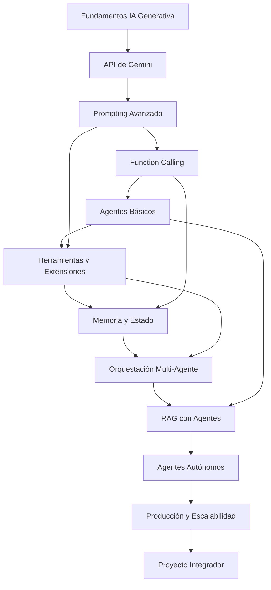

# ARQUITECTURA CURRICULAR: Automatización con Agentes en Google Gemini

## METADATA

- **Complejidad**: Alta (Progresión 0 a Experto)
- **Duración estimada**: 80-100 horas
- **Audiencia objetivo**: Ingenieros de software que buscan dominar la creación y orquestación de agentes inteligentes
- **Prerrequisitos obligatorios**:
  1. Programación en Python (nivel intermedio)
  2. Conceptos básicos de APIs REST
  3. Familiaridad con JSON y estructuras de datos
  4. Cuenta de Google Cloud Platform (GCP)
- **Fecha de diseño**: 2026-02-04

---

## MAPA CONCEPTUAL



---

## OBJETIVOS GENERALES DEL CURSO

1. **Diseñar e implementar** agentes inteligentes utilizando la API de Google Gemini que resuelvan problemas reales de automatización.
2. **Construir sistemas multi-agente** con capacidades de orquestación, memoria persistente y toma de decisiones autónoma.
3. **Integrar agentes con fuentes externas** mediante Function Calling, RAG y herramientas personalizadas.
4. **Desplegar agentes en producción** con consideraciones de escalabilidad, seguridad y monitoreo.
5. **Evaluar y optimizar** el rendimiento de agentes mediante métricas cuantitativas y cualitativas.

---

## ESTRUCTURA MODULAR

### MÓDULO 0: Diagnóstico y Nivelación

**Duración**: 4-6 horas
**Objetivo**: Validar prerrequisitos y establecer fundamentos de IA generativa

#### TEMA 0.1: Fundamentos de IA Generativa

**Objetivo del Tema**: Comprender los principios que sustentan los modelos de lenguaje grandes (LLMs)

- **Subtema 0.1.1**: Arquitectura Transformer y Mecanismo de Atención
  - Objetivo: Explicar cómo los transformers procesan secuencias
  - Tipo: Teoría
  - Requiere Código: No

- **Subtema 0.1.2**: Modelos de Lenguaje y Generación de Texto
  - Objetivo: Describir el proceso de generación autoregresiva
  - Tipo: Teoría
  - Requiere Código: No

- **Subtema 0.1.3**: Familia de Modelos Gemini
  - Objetivo: Diferenciar variantes de Gemini (Pro, Flash, Ultra, Nano)
  - Tipo: Teoría
  - Requiere Código: No

#### TEMA 0.2: Configuración del Entorno de Desarrollo

**Objetivo del Tema**: Preparar el ambiente técnico para el desarrollo con Gemini

- **Subtema 0.2.1**: Configuración de Google Cloud y API Keys
  - Objetivo: Crear proyecto GCP y obtener credenciales API
  - Tipo: Práctica
  - Requiere Código: Sí

- **Subtema 0.2.2**: Instalación del SDK de Google Generative AI
  - Objetivo: Instalar y configurar google-generativeai en Python
  - Tipo: Práctica
  - Requiere Código: Sí

- **Subtema 0.2.3**: Primera Interacción con Gemini
  - Objetivo: Ejecutar llamada básica a la API y procesar respuesta
  - Tipo: Práctica
  - Requiere Código: Sí

---

### MÓDULO 1: Dominio de la API de Gemini

**Duración**: 8-10 horas
**Objetivo**: Dominar todas las capacidades de la API de Gemini para generación de contenido

#### TEMA 1.1: Generación de Texto y Parámetros

**Objetivo del Tema**: Controlar la generación de texto mediante parámetros de configuración

- **Subtema 1.1.1**: Métodos generate_content y stream
  - Objetivo: Implementar generación síncrona y streaming
  - Tipo: Práctica
  - Requiere Código: Sí

- **Subtema 1.1.2**: Configuración de Temperature, Top-P, Top-K
  - Objetivo: Ajustar parámetros para controlar creatividad vs determinismo
  - Tipo: Mixto
  - Requiere Código: Sí

- **Subtema 1.1.3**: Tokens, Límites y Costos
  - Objetivo: Calcular y optimizar consumo de tokens
  - Tipo: Mixto
  - Requiere Código: Sí

#### TEMA 1.2: Capacidades Multimodales

**Objetivo del Tema**: Procesar imágenes, audio y video con Gemini

- **Subtema 1.2.1**: Análisis de Imágenes
  - Objetivo: Implementar visión computacional con Gemini Pro Vision
  - Tipo: Práctica
  - Requiere Código: Sí

- **Subtema 1.2.2**: Procesamiento de Audio y Video
  - Objetivo: Transcribir y analizar contenido multimedia
  - Tipo: Práctica
  - Requiere Código: Sí

- **Subtema 1.2.3**: Generación Multimodal
  - Objetivo: Crear contenido que combine múltiples modalidades
  - Tipo: Práctica
  - Requiere Código: Sí

#### TEMA 1.3: Gestión de Conversaciones

**Objetivo del Tema**: Implementar diálogos multi-turno con contexto

- **Subtema 1.3.1**: Chat Sessions y Historial
  - Objetivo: Mantener contexto conversacional entre turnos
  - Tipo: Práctica
  - Requiere Código: Sí

- **Subtema 1.3.2**: System Instructions
  - Objetivo: Definir comportamiento base del modelo mediante instrucciones de sistema
  - Tipo: Práctica
  - Requiere Código: Sí

---

### MÓDULO 2: Ingeniería de Prompts Avanzada

**Duración**: 10-12 horas
**Objetivo**: Diseñar prompts que maximicen la efectividad de los agentes

#### TEMA 2.1: Fundamentos de Prompting

**Objetivo del Tema**: Aplicar técnicas estructuradas de diseño de prompts

- **Subtema 2.1.1**: Anatomía de un Prompt Efectivo
  - Objetivo: Estructurar prompts con contexto, instrucción y formato
  - Tipo: Mixto
  - Requiere Código: Sí

- **Subtema 2.1.2**: Zero-Shot, One-Shot y Few-Shot Learning
  - Objetivo: Seleccionar estrategia de ejemplos según el problema
  - Tipo: Práctica
  - Requiere Código: Sí

- **Subtema 2.1.3**: Role Prompting y Personas
  - Objetivo: Definir roles especializados para el modelo
  - Tipo: Práctica
  - Requiere Código: Sí

#### TEMA 2.2: Técnicas Avanzadas de Razonamiento

**Objetivo del Tema**: Implementar prompts que mejoren el razonamiento del modelo

- **Subtema 2.2.1**: Chain of Thought (CoT) Prompting
  - Objetivo: Guiar al modelo a mostrar razonamiento paso a paso
  - Tipo: Práctica
  - Requiere Código: Sí

- **Subtema 2.2.2**: Self-Consistency y Majority Voting
  - Objetivo: Mejorar precisión mediante múltiples muestreos
  - Tipo: Práctica
  - Requiere Código: Sí

- **Subtema 2.2.3**: Tree of Thoughts (ToT)
  - Objetivo: Implementar exploración de múltiples caminos de razonamiento
  - Tipo: Práctica
  - Requiere Código: Sí

#### TEMA 2.3: Prompts para Agentes

**Objetivo del Tema**: Diseñar prompts específicos para comportamiento agéntico

- **Subtema 2.3.1**: Prompts de Planificación y Descomposición
  - Objetivo: Crear prompts que generen planes de acción estructurados
  - Tipo: Práctica
  - Requiere Código: Sí

- **Subtema 2.3.2**: Prompts de Reflexión y Auto-Crítica
  - Objetivo: Implementar bucles de auto-evaluación
  - Tipo: Práctica
  - Requiere Código: Sí

- **Subtema 2.3.3**: Manejo de Errores y Recuperación
  - Objetivo: Diseñar prompts robustos ante fallos
  - Tipo: Práctica
  - Requiere Código: Sí

---

### MÓDULO 3: Function Calling y Herramientas

**Duración**: 12-14 horas
**Objetivo**: Conectar agentes con el mundo exterior mediante funciones y APIs

#### TEMA 3.1: Fundamentos de Function Calling

**Objetivo del Tema**: Implementar la invocación de funciones desde Gemini

- **Subtema 3.1.1**: Declaración de Funciones con JSON Schema
  - Objetivo: Definir esquemas de funciones que Gemini pueda invocar
  - Tipo: Práctica
  - Requiere Código: Sí

- **Subtema 3.1.2**: Ciclo de Vida de Function Calling
  - Objetivo: Implementar el flujo completo request-function-response
  - Tipo: Práctica
  - Requiere Código: Sí

- **Subtema 3.1.3**: Parallel Function Calling
  - Objetivo: Manejar múltiples invocaciones de funciones simultáneas
  - Tipo: Práctica
  - Requiere Código: Sí

#### TEMA 3.2: Diseño de Herramientas

**Objetivo del Tema**: Crear herramientas reutilizables para agentes

- **Subtema 3.2.1**: Patrones de Diseño de Tools
  - Objetivo: Aplicar mejores prácticas en diseño de herramientas
  - Tipo: Mixto
  - Requiere Código: Sí

- **Subtema 3.2.2**: Herramientas de Búsqueda y Retrieval
  - Objetivo: Implementar tools para búsqueda web y bases de datos
  - Tipo: Práctica
  - Requiere Código: Sí

- **Subtema 3.2.3**: Herramientas de Ejecución de Código
  - Objetivo: Crear sandboxes seguros para ejecución de código generado
  - Tipo: Práctica
  - Requiere Código: Sí

#### TEMA 3.3: Integración con APIs Externas

**Objetivo del Tema**: Conectar agentes con servicios de terceros

- **Subtema 3.3.1**: APIs REST y Autenticación
  - Objetivo: Implementar llamadas autenticadas a APIs externas
  - Tipo: Práctica
  - Requiere Código: Sí

- **Subtema 3.3.2**: Manejo de Respuestas Asíncronas
  - Objetivo: Gestionar operaciones de larga duración
  - Tipo: Práctica
  - Requiere Código: Sí

- **Subtema 3.3.3**: Rate Limiting y Retry Patterns
  - Objetivo: Implementar manejo robusto de errores de API
  - Tipo: Práctica
  - Requiere Código: Sí

---

### MÓDULO 4: Arquitectura de Agentes Básicos

**Duración**: 10-12 horas
**Objetivo**: Construir agentes funcionales con ciclo de percepción-acción

#### TEMA 4.1: Anatomía de un Agente

**Objetivo del Tema**: Comprender los componentes fundamentales de un agente

- **Subtema 4.1.1**: Modelo ReAct (Reasoning + Acting)
  - Objetivo: Implementar el patrón de razonamiento y acción intercalados
  - Tipo: Mixto
  - Requiere Código: Sí

- **Subtema 4.1.2**: Bucle de Agente: Observe-Think-Act
  - Objetivo: Construir el ciclo principal de ejecución de un agente
  - Tipo: Práctica
  - Requiere Código: Sí

- **Subtema 4.1.3**: Condiciones de Terminación
  - Objetivo: Definir criterios de parada robustos
  - Tipo: Práctica
  - Requiere Código: Sí

#### TEMA 4.2: Planificación y Descomposición de Tareas

**Objetivo del Tema**: Implementar capacidades de planificación en agentes

- **Subtema 4.2.1**: Task Decomposition Automática
  - Objetivo: Crear agentes que descomponen tareas complejas
  - Tipo: Práctica
  - Requiere Código: Sí

- **Subtema 4.2.2**: Plan-and-Execute Pattern
  - Objetivo: Separar planificación de ejecución
  - Tipo: Práctica
  - Requiere Código: Sí

- **Subtema 4.2.3**: Replanificación Dinámica
  - Objetivo: Ajustar planes ante cambios o errores
  - Tipo: Práctica
  - Requiere Código: Sí

#### TEMA 4.3: Implementación Práctica

**Objetivo del Tema**: Construir agentes completos para casos de uso reales

- **Subtema 4.3.1**: Agente de Investigación Web
  - Objetivo: Crear agente que busca, sintetiza y reporta información
  - Tipo: Práctica
  - Requiere Código: Sí

- **Subtema 4.3.2**: Agente de Análisis de Datos
  - Objetivo: Implementar agente que procesa y visualiza datasets
  - Tipo: Práctica
  - Requiere Código: Sí

- **Subtema 4.3.3**: Agente de Automatización de Tareas
  - Objetivo: Construir agente para flujos de trabajo repetitivos
  - Tipo: Práctica
  - Requiere Código: Sí

---

### MÓDULO 5: Memoria y Estado en Agentes

**Duración**: 8-10 horas
**Objetivo**: Dotar a los agentes de memoria persistente y gestión de estado

#### TEMA 5.1: Tipos de Memoria

**Objetivo del Tema**: Implementar diferentes sistemas de memoria para agentes

- **Subtema 5.1.1**: Memoria de Trabajo (Short-term)
  - Objetivo: Gestionar contexto dentro de una sesión
  - Tipo: Práctica
  - Requiere Código: Sí

- **Subtema 5.1.2**: Memoria Episódica (Long-term)
  - Objetivo: Almacenar y recuperar experiencias pasadas
  - Tipo: Práctica
  - Requiere Código: Sí

- **Subtema 5.1.3**: Memoria Semántica
  - Objetivo: Construir base de conocimiento persistente
  - Tipo: Práctica
  - Requiere Código: Sí

#### TEMA 5.2: Implementación de Memoria

**Objetivo del Tema**: Construir sistemas de memoria con diferentes backends

- **Subtema 5.2.1**: Memoria con Vector Stores
  - Objetivo: Usar embeddings para retrieval semántico de memoria
  - Tipo: Práctica
  - Requiere Código: Sí

- **Subtema 5.2.2**: Memoria Estructurada (Grafos de Conocimiento)
  - Objetivo: Implementar memoria basada en grafos
  - Tipo: Práctica
  - Requiere Código: Sí

- **Subtema 5.2.3**: Compresión y Sumarización de Memoria
  - Objetivo: Manejar límites de contexto mediante resúmenes
  - Tipo: Práctica
  - Requiere Código: Sí

---

### MÓDULO 6: Retrieval-Augmented Generation (RAG) con Agentes

**Duración**: 10-12 horas
**Objetivo**: Integrar conocimiento externo en agentes mediante RAG

#### TEMA 6.1: Fundamentos de RAG

**Objetivo del Tema**: Comprender e implementar pipelines RAG básicos

- **Subtema 6.1.1**: Arquitectura RAG: Indexación y Retrieval
  - Objetivo: Construir pipeline de ingestión y búsqueda
  - Tipo: Práctica
  - Requiere Código: Sí

- **Subtema 6.1.2**: Embeddings con Gemini
  - Objetivo: Generar y usar embeddings de texto con la API
  - Tipo: Práctica
  - Requiere Código: Sí

- **Subtema 6.1.3**: Vector Databases (Pinecone, Chroma, Weaviate)
  - Objetivo: Integrar bases de datos vectoriales
  - Tipo: Práctica
  - Requiere Código: Sí

#### TEMA 6.2: RAG Avanzado

**Objetivo del Tema**: Implementar técnicas avanzadas de retrieval

- **Subtema 6.2.1**: Hybrid Search (Dense + Sparse)
  - Objetivo: Combinar búsqueda semántica y por keywords
  - Tipo: Práctica
  - Requiere Código: Sí

- **Subtema 6.2.2**: Re-ranking y Filtering
  - Objetivo: Mejorar relevancia de resultados recuperados
  - Tipo: Práctica
  - Requiere Código: Sí

- **Subtema 6.2.3**: Agentic RAG: Retrieval Iterativo
  - Objetivo: Implementar agentes que refinan sus búsquedas
  - Tipo: Práctica
  - Requiere Código: Sí

#### TEMA 6.3: RAG en Producción

**Objetivo del Tema**: Desplegar y mantener sistemas RAG escalables

- **Subtema 6.3.1**: Estrategias de Chunking
  - Objetivo: Optimizar segmentación de documentos
  - Tipo: Mixto
  - Requiere Código: Sí

- **Subtema 6.3.2**: Evaluación de Calidad de RAG
  - Objetivo: Medir retrieval precision, recall y answer quality
  - Tipo: Práctica
  - Requiere Código: Sí

- **Subtema 6.3.3**: Actualización Incremental de Índices
  - Objetivo: Mantener conocimiento actualizado sin re-indexación total
  - Tipo: Práctica
  - Requiere Código: Sí

---

### MÓDULO 7: Sistemas Multi-Agente

**Duración**: 12-14 horas
**Objetivo**: Diseñar y orquestar sistemas con múltiples agentes colaborativos

#### TEMA 7.1: Patrones de Colaboración

**Objetivo del Tema**: Implementar diferentes modelos de interacción entre agentes

- **Subtema 7.1.1**: Arquitectura Supervisor-Worker
  - Objetivo: Crear jerarquías de agentes con delegación
  - Tipo: Práctica
  - Requiere Código: Sí

- **Subtema 7.1.2**: Debate y Consenso entre Agentes
  - Objetivo: Implementar discusión y votación entre agentes
  - Tipo: Práctica
  - Requiere Código: Sí

- **Subtema 7.1.3**: Pipeline de Agentes Especializados
  - Objetivo: Construir cadenas de procesamiento con agentes
  - Tipo: Práctica
  - Requiere Código: Sí

#### TEMA 7.2: Comunicación Inter-Agente

**Objetivo del Tema**: Diseñar protocolos de comunicación efectivos

- **Subtema 7.2.1**: Formatos de Mensaje Estructurados
  - Objetivo: Definir esquemas de comunicación entre agentes
  - Tipo: Práctica
  - Requiere Código: Sí

- **Subtema 7.2.2**: Memoria Compartida vs Paso de Mensajes
  - Objetivo: Seleccionar estrategia de comunicación según contexto
  - Tipo: Mixto
  - Requiere Código: Sí

- **Subtema 7.2.3**: Manejo de Conflictos y Deadlocks
  - Objetivo: Resolver situaciones de bloqueo entre agentes
  - Tipo: Práctica
  - Requiere Código: Sí

#### TEMA 7.3: Orquestación con Frameworks

**Objetivo del Tema**: Utilizar frameworks especializados para multi-agente

- **Subtema 7.3.1**: LangGraph para Grafos de Agentes
  - Objetivo: Construir flujos complejos con LangGraph
  - Tipo: Práctica
  - Requiere Código: Sí

- **Subtema 7.3.2**: CrewAI para Equipos de Agentes
  - Objetivo: Implementar crews con roles definidos
  - Tipo: Práctica
  - Requiere Código: Sí

- **Subtema 7.3.3**: AutoGen para Conversaciones Multi-Agente
  - Objetivo: Crear sistemas conversacionales con AutoGen
  - Tipo: Práctica
  - Requiere Código: Sí

---

### MÓDULO 8: Agentes Autónomos y Reasoning Avanzado

**Duración**: 10-12 horas
**Objetivo**: Construir agentes con alta autonomía y capacidades de razonamiento complejo

#### TEMA 8.1: Arquitecturas de Agentes Autónomos

**Objetivo del Tema**: Implementar patrones para agentes de larga ejecución

- **Subtema 8.1.1**: BabyAGI y Task-Driven Agents
  - Objetivo: Crear agentes que generan y priorizan sus propias tareas
  - Tipo: Práctica
  - Requiere Código: Sí

- **Subtema 8.1.2**: AutoGPT Pattern: Goals → Tasks → Execution
  - Objetivo: Implementar ciclo de objetivos a resultados
  - Tipo: Práctica
  - Requiere Código: Sí

- **Subtema 8.1.3**: Agentes con Aprendizaje Continuo
  - Objetivo: Construir agentes que mejoran con experiencia
  - Tipo: Práctica
  - Requiere Código: Sí

#### TEMA 8.2: Razonamiento Complejo

**Objetivo del Tema**: Dotar a agentes de capacidades de razonamiento avanzado

- **Subtema 8.2.1**: Razonamiento Causal
  - Objetivo: Implementar inferencia de causa-efecto
  - Tipo: Mixto
  - Requiere Código: Sí

- **Subtema 8.2.2**: Meta-Cognición: Agentes que Razonan sobre su Razonamiento
  - Objetivo: Crear bucles de auto-evaluación y mejora
  - Tipo: Práctica
  - Requiere Código: Sí

- **Subtema 8.2.3**: Manejo de Incertidumbre
  - Objetivo: Implementar razonamiento probabilístico en decisiones
  - Tipo: Práctica
  - Requiere Código: Sí

---

### MÓDULO 9: Evaluación y Testing de Agentes

**Duración**: 6-8 horas
**Objetivo**: Medir y asegurar la calidad de sistemas basados en agentes

#### TEMA 9.1: Métricas de Evaluación

**Objetivo del Tema**: Definir y calcular métricas para agentes

- **Subtema 9.1.1**: Task Completion Rate y Success Criteria
  - Objetivo: Medir efectividad en completar tareas asignadas
  - Tipo: Mixto
  - Requiere Código: Sí

- **Subtema 9.1.2**: Eficiencia: Tokens, Latencia, Costo
  - Objetivo: Optimizar recursos consumidos por agentes
  - Tipo: Práctica
  - Requiere Código: Sí

- **Subtema 9.1.3**: Calidad de Razonamiento (Chain Quality)
  - Objetivo: Evaluar la lógica de las cadenas de pensamiento
  - Tipo: Mixto
  - Requiere Código: Sí

#### TEMA 9.2: Testing de Agentes

**Objetivo del Tema**: Implementar estrategias de testing robustas

- **Subtema 9.2.1**: Unit Testing de Tools y Functions
  - Objetivo: Crear tests para componentes individuales
  - Tipo: Práctica
  - Requiere Código: Sí

- **Subtema 9.2.2**: Integration Testing de Flujos
  - Objetivo: Validar interacciones end-to-end
  - Tipo: Práctica
  - Requiere Código: Sí

- **Subtema 9.2.3**: Adversarial Testing y Edge Cases
  - Objetivo: Identificar y manejar casos límite
  - Tipo: Práctica
  - Requiere Código: Sí

---

### MÓDULO 10: Despliegue en Producción

**Duración**: 8-10 horas
**Objetivo**: Llevar agentes a ambientes productivos con garantías de calidad

#### TEMA 10.1: Arquitectura de Producción

**Objetivo del Tema**: Diseñar infraestructura para agentes en producción

- **Subtema 10.1.1**: APIs y Microservicios para Agentes
  - Objetivo: Exponer agentes como servicios escalables
  - Tipo: Práctica
  - Requiere Código: Sí

- **Subtema 10.1.2**: Colas y Procesamiento Asíncrono
  - Objetivo: Manejar cargas de trabajo con colas de mensajes
  - Tipo: Práctica
  - Requiere Código: Sí

- **Subtema 10.1.3**: Stateless vs Stateful Agents
  - Objetivo: Elegir arquitectura según requisitos de estado
  - Tipo: Mixto
  - Requiere Código: Sí

#### TEMA 10.2: Seguridad y Guardrails

**Objetivo del Tema**: Implementar controles de seguridad para agentes

- **Subtema 10.2.1**: Input Validation y Prompt Injection Prevention
  - Objetivo: Proteger agentes de entradas maliciosas
  - Tipo: Práctica
  - Requiere Código: Sí

- **Subtema 10.2.2**: Output Filtering y Content Moderation
  - Objetivo: Filtrar respuestas inapropiadas o peligrosas
  - Tipo: Práctica
  - Requiere Código: Sí

- **Subtema 10.2.3**: Rate Limiting y Abuse Prevention
  - Objetivo: Proteger contra uso excesivo o malintencionado
  - Tipo: Práctica
  - Requiere Código: Sí

#### TEMA 10.3: Observabilidad y Monitoreo

**Objetivo del Tema**: Implementar telemetría completa para agentes

- **Subtema 10.3.1**: Logging Estructurado de Agentes
  - Objetivo: Registrar trazas de ejecución para debugging
  - Tipo: Práctica
  - Requiere Código: Sí

- **Subtema 10.3.2**: Métricas y Dashboards
  - Objetivo: Visualizar KPIs de agentes en tiempo real
  - Tipo: Práctica
  - Requiere Código: Sí

- **Subtema 10.3.3**: Alerting y Incident Response
  - Objetivo: Detectar y responder a anomalías automáticamente
  - Tipo: Práctica
  - Requiere Código: Sí

---

### MÓDULO 11: Proyecto Integrador Final

**Duración**: 12-15 horas
**Objetivo**: Sintetizar todos los conceptos en un sistema multi-agente completo

### Especificaciones del Proyecto

- **Alcance**: Construir un sistema de agentes para automatización empresarial que incluya:
  - Agente coordinador (supervisor)
  - Agentes especializados (investigación, análisis, ejecución)
  - Sistema de memoria persistente
  - Integración RAG con documentos corporativos
  - API REST para interacción externa
  - Dashboard de monitoreo

- **Entregables**:
  1. Código fuente completo con documentación
  2. Tests unitarios e integración (>80% coverage)
  3. Documentación de arquitectura (diagramas)
  4. Demo funcional con casos de uso reales
  5. Informe de métricas de rendimiento

- **Criterios de Evaluación**:
  - Correctitud funcional (40%)
  - Calidad de código y arquitectura (25%)
  - Robustez y manejo de errores (15%)
  - Documentación y tests (10%)
  - Innovación y creatividad (10%)

### Diferenciación por Nivel

**Básico**: Sistema de 2 agentes con herramientas predefinidas, memoria en sesión, API básica.

**Intermedio**: Sistema de 3-4 agentes con herramientas custom, RAG integrado, memoria persistente, monitoreo básico.

**Avanzado**: Sistema multi-agente completo con orquestación dinámica, aprendizaje de preferencias, auto-evaluación, despliegue en cloud con CI/CD.

---

## RECURSOS TÉCNICOS REQUERIDOS

### Para el Estudiante

- **Herramientas de desarrollo**:
  - Python 3.10+
  - IDE (VSCode, PyCharm)
  - Git
  - Docker (recomendado)

- **Librerías/frameworks**:
  - google-generativeai >= 0.4.0
  - langchain >= 0.1.0
  - langgraph >= 0.0.20
  - chromadb >= 0.4.0
  - fastapi >= 0.100.0
  - pytest >= 7.0.0

- **Hardware mínimo**:
  - 8GB RAM
  - Conexión a internet estable
  - (Opcional) GPU para embeddings locales

- **Recursos cloud**:
  - Cuenta GCP con créditos de API Gemini
  - (Opcional) Cuenta en Pinecone/Weaviate

### Para el Instructor/Plataforma

- Sistema de evaluación automática: Tests automatizados con GitHub Actions
- Generación de casos de prueba: Sí, complejidad media-alta
- Visualizaciones interactivas: Diagramas de flujo de agentes, traces visuales

---

## PLAN DE ACTUALIZACIÓN

- **Vigencia estimada**: 12-18 meses
- **Puntos de obsolescencia**:
  - Versiones de API de Gemini
  - Frameworks de agentes (LangChain, LangGraph)
  - Mejores prácticas de seguridad
- **Estrategia de mantenimiento**: Revisión trimestral de compatibilidad de código, actualización semestral de contenido

---

## MATRIZ DE TRAZABILIDAD

| Módulo    | Conceptos | Objetivos Bloom      | Evaluaciones         | Tiempo (h) |
| --------- | --------- | -------------------- | -------------------- | ---------- |
| 0         | 6         | Recordar, Comprender | Diagnóstica          | 5          |
| 1         | 9         | Comprender, Aplicar  | Formativa            | 9          |
| 2         | 9         | Aplicar, Analizar    | Formativa            | 11         |
| 3         | 9         | Aplicar, Analizar    | Formativa            | 13         |
| 4         | 9         | Aplicar, Crear       | Formativa + Sumativa | 11         |
| 5         | 6         | Aplicar, Analizar    | Formativa            | 9          |
| 6         | 9         | Aplicar, Evaluar     | Formativa + Sumativa | 11         |
| 7         | 9         | Analizar, Crear      | Formativa            | 13         |
| 8         | 6         | Evaluar, Crear       | Formativa            | 11         |
| 9         | 6         | Evaluar, Analizar    | Formativa            | 7          |
| 10        | 9         | Aplicar, Crear       | Formativa            | 9          |
| 11        | Integrado | Crear                | Sumativa Final       | 14         |
| **TOTAL** | **87**    | **-**                | **15**               | **~100**   |

---

## ALERTAS Y CONSIDERACIONES

### Cuellos de Botella Identificados

1. **Módulo 3 (Function Calling)**: Alta complejidad en debugging de esquemas JSON
2. **Módulo 6 (RAG)**: Curva de aprendizaje pronunciada en vectores y embeddings
3. **Módulo 7 (Multi-Agente)**: Dificultad en debugging de interacciones complejas

### Estrategias de Mitigación

- Proporcionar templates de funciones listos para usar
- Incluir datasets pre-procesados para prácticas de RAG
- Ofrecer visualizadores de trazas de agentes

### Flexibilidad del Plan

- Módulos 0-4 son obligatorios y secuenciales
- Módulos 5-6 pueden intercambiarse según preferencia
- Módulo 8 puede omitirse para ruta acelerada
- Módulo 9 puede integrarse parcialmente en otros módulos

---

## ÁRBOL CURRICULAR (JSON)

```json
[
  {
    "modulo_id": 0,
    "titulo": "Diagnóstico y Nivelación",
    "temas": [
      {
        "tema_id": "0.1",
        "titulo": "Fundamentos de IA Generativa",
        "subtemas": [
          {
            "subtema_id": "0.1.1",
            "titulo": "Arquitectura Transformer y Mecanismo de Atención"
          },
          {
            "subtema_id": "0.1.2",
            "titulo": "Modelos de Lenguaje y Generación de Texto"
          },
          { "subtema_id": "0.1.3", "titulo": "Familia de Modelos Gemini" }
        ]
      },
      {
        "tema_id": "0.2",
        "titulo": "Configuración del Entorno de Desarrollo",
        "subtemas": [
          {
            "subtema_id": "0.2.1",
            "titulo": "Configuración de Google Cloud y API Keys"
          },
          {
            "subtema_id": "0.2.2",
            "titulo": "Instalación del SDK de Google Generative AI"
          },
          { "subtema_id": "0.2.3", "titulo": "Primera Interacción con Gemini" }
        ]
      }
    ]
  },
  {
    "modulo_id": 1,
    "titulo": "Dominio de la API de Gemini",
    "temas": [
      {
        "tema_id": "1.1",
        "titulo": "Generación de Texto y Parámetros",
        "subtemas": [
          {
            "subtema_id": "1.1.1",
            "titulo": "Métodos generate_content y stream"
          },
          {
            "subtema_id": "1.1.2",
            "titulo": "Configuración de Temperature, Top-P, Top-K"
          },
          { "subtema_id": "1.1.3", "titulo": "Tokens, Límites y Costos" }
        ]
      },
      {
        "tema_id": "1.2",
        "titulo": "Capacidades Multimodales",
        "subtemas": [
          { "subtema_id": "1.2.1", "titulo": "Análisis de Imágenes" },
          { "subtema_id": "1.2.2", "titulo": "Procesamiento de Audio y Video" },
          { "subtema_id": "1.2.3", "titulo": "Generación Multimodal" }
        ]
      },
      {
        "tema_id": "1.3",
        "titulo": "Gestión de Conversaciones",
        "subtemas": [
          { "subtema_id": "1.3.1", "titulo": "Chat Sessions y Historial" },
          { "subtema_id": "1.3.2", "titulo": "System Instructions" }
        ]
      }
    ]
  },
  {
    "modulo_id": 2,
    "titulo": "Ingeniería de Prompts Avanzada",
    "temas": [
      {
        "tema_id": "2.1",
        "titulo": "Fundamentos de Prompting",
        "subtemas": [
          { "subtema_id": "2.1.1", "titulo": "Anatomía de un Prompt Efectivo" },
          {
            "subtema_id": "2.1.2",
            "titulo": "Zero-Shot, One-Shot y Few-Shot Learning"
          },
          { "subtema_id": "2.1.3", "titulo": "Role Prompting y Personas" }
        ]
      },
      {
        "tema_id": "2.2",
        "titulo": "Técnicas Avanzadas de Razonamiento",
        "subtemas": [
          {
            "subtema_id": "2.2.1",
            "titulo": "Chain of Thought (CoT) Prompting"
          },
          {
            "subtema_id": "2.2.2",
            "titulo": "Self-Consistency y Majority Voting"
          },
          { "subtema_id": "2.2.3", "titulo": "Tree of Thoughts (ToT)" }
        ]
      },
      {
        "tema_id": "2.3",
        "titulo": "Prompts para Agentes",
        "subtemas": [
          {
            "subtema_id": "2.3.1",
            "titulo": "Prompts de Planificación y Descomposición"
          },
          {
            "subtema_id": "2.3.2",
            "titulo": "Prompts de Reflexión y Auto-Crítica"
          },
          {
            "subtema_id": "2.3.3",
            "titulo": "Manejo de Errores y Recuperación"
          }
        ]
      }
    ]
  },
  {
    "modulo_id": 3,
    "titulo": "Function Calling y Herramientas",
    "temas": [
      {
        "tema_id": "3.1",
        "titulo": "Fundamentos de Function Calling",
        "subtemas": [
          {
            "subtema_id": "3.1.1",
            "titulo": "Declaración de Funciones con JSON Schema"
          },
          {
            "subtema_id": "3.1.2",
            "titulo": "Ciclo de Vida de Function Calling"
          },
          { "subtema_id": "3.1.3", "titulo": "Parallel Function Calling" }
        ]
      },
      {
        "tema_id": "3.2",
        "titulo": "Diseño de Herramientas",
        "subtemas": [
          { "subtema_id": "3.2.1", "titulo": "Patrones de Diseño de Tools" },
          {
            "subtema_id": "3.2.2",
            "titulo": "Herramientas de Búsqueda y Retrieval"
          },
          {
            "subtema_id": "3.2.3",
            "titulo": "Herramientas de Ejecución de Código"
          }
        ]
      },
      {
        "tema_id": "3.3",
        "titulo": "Integración con APIs Externas",
        "subtemas": [
          { "subtema_id": "3.3.1", "titulo": "APIs REST y Autenticación" },
          {
            "subtema_id": "3.3.2",
            "titulo": "Manejo de Respuestas Asíncronas"
          },
          { "subtema_id": "3.3.3", "titulo": "Rate Limiting y Retry Patterns" }
        ]
      }
    ]
  },
  {
    "modulo_id": 4,
    "titulo": "Arquitectura de Agentes Básicos",
    "temas": [
      {
        "tema_id": "4.1",
        "titulo": "Anatomía de un Agente",
        "subtemas": [
          {
            "subtema_id": "4.1.1",
            "titulo": "Modelo ReAct (Reasoning + Acting)"
          },
          {
            "subtema_id": "4.1.2",
            "titulo": "Bucle de Agente: Observe-Think-Act"
          },
          { "subtema_id": "4.1.3", "titulo": "Condiciones de Terminación" }
        ]
      },
      {
        "tema_id": "4.2",
        "titulo": "Planificación y Descomposición de Tareas",
        "subtemas": [
          { "subtema_id": "4.2.1", "titulo": "Task Decomposition Automática" },
          { "subtema_id": "4.2.2", "titulo": "Plan-and-Execute Pattern" },
          { "subtema_id": "4.2.3", "titulo": "Replanificación Dinámica" }
        ]
      },
      {
        "tema_id": "4.3",
        "titulo": "Implementación Práctica",
        "subtemas": [
          { "subtema_id": "4.3.1", "titulo": "Agente de Investigación Web" },
          { "subtema_id": "4.3.2", "titulo": "Agente de Análisis de Datos" },
          {
            "subtema_id": "4.3.3",
            "titulo": "Agente de Automatización de Tareas"
          }
        ]
      }
    ]
  },
  {
    "modulo_id": 5,
    "titulo": "Memoria y Estado en Agentes",
    "temas": [
      {
        "tema_id": "5.1",
        "titulo": "Tipos de Memoria",
        "subtemas": [
          {
            "subtema_id": "5.1.1",
            "titulo": "Memoria de Trabajo (Short-term)"
          },
          { "subtema_id": "5.1.2", "titulo": "Memoria Episódica (Long-term)" },
          { "subtema_id": "5.1.3", "titulo": "Memoria Semántica" }
        ]
      },
      {
        "tema_id": "5.2",
        "titulo": "Implementación de Memoria",
        "subtemas": [
          { "subtema_id": "5.2.1", "titulo": "Memoria con Vector Stores" },
          {
            "subtema_id": "5.2.2",
            "titulo": "Memoria Estructurada (Grafos de Conocimiento)"
          },
          {
            "subtema_id": "5.2.3",
            "titulo": "Compresión y Sumarización de Memoria"
          }
        ]
      }
    ]
  },
  {
    "modulo_id": 6,
    "titulo": "Retrieval-Augmented Generation (RAG) con Agentes",
    "temas": [
      {
        "tema_id": "6.1",
        "titulo": "Fundamentos de RAG",
        "subtemas": [
          {
            "subtema_id": "6.1.1",
            "titulo": "Arquitectura RAG: Indexación y Retrieval"
          },
          { "subtema_id": "6.1.2", "titulo": "Embeddings con Gemini" },
          {
            "subtema_id": "6.1.3",
            "titulo": "Vector Databases (Pinecone, Chroma, Weaviate)"
          }
        ]
      },
      {
        "tema_id": "6.2",
        "titulo": "RAG Avanzado",
        "subtemas": [
          { "subtema_id": "6.2.1", "titulo": "Hybrid Search (Dense + Sparse)" },
          { "subtema_id": "6.2.2", "titulo": "Re-ranking y Filtering" },
          {
            "subtema_id": "6.2.3",
            "titulo": "Agentic RAG: Retrieval Iterativo"
          }
        ]
      },
      {
        "tema_id": "6.3",
        "titulo": "RAG en Producción",
        "subtemas": [
          { "subtema_id": "6.3.1", "titulo": "Estrategias de Chunking" },
          { "subtema_id": "6.3.2", "titulo": "Evaluación de Calidad de RAG" },
          {
            "subtema_id": "6.3.3",
            "titulo": "Actualización Incremental de Índices"
          }
        ]
      }
    ]
  },
  {
    "modulo_id": 7,
    "titulo": "Sistemas Multi-Agente",
    "temas": [
      {
        "tema_id": "7.1",
        "titulo": "Patrones de Colaboración",
        "subtemas": [
          { "subtema_id": "7.1.1", "titulo": "Arquitectura Supervisor-Worker" },
          {
            "subtema_id": "7.1.2",
            "titulo": "Debate y Consenso entre Agentes"
          },
          {
            "subtema_id": "7.1.3",
            "titulo": "Pipeline de Agentes Especializados"
          }
        ]
      },
      {
        "tema_id": "7.2",
        "titulo": "Comunicación Inter-Agente",
        "subtemas": [
          {
            "subtema_id": "7.2.1",
            "titulo": "Formatos de Mensaje Estructurados"
          },
          {
            "subtema_id": "7.2.2",
            "titulo": "Memoria Compartida vs Paso de Mensajes"
          },
          {
            "subtema_id": "7.2.3",
            "titulo": "Manejo de Conflictos y Deadlocks"
          }
        ]
      },
      {
        "tema_id": "7.3",
        "titulo": "Orquestación con Frameworks",
        "subtemas": [
          {
            "subtema_id": "7.3.1",
            "titulo": "LangGraph para Grafos de Agentes"
          },
          { "subtema_id": "7.3.2", "titulo": "CrewAI para Equipos de Agentes" },
          {
            "subtema_id": "7.3.3",
            "titulo": "AutoGen para Conversaciones Multi-Agente"
          }
        ]
      }
    ]
  },
  {
    "modulo_id": 8,
    "titulo": "Agentes Autónomos y Reasoning Avanzado",
    "temas": [
      {
        "tema_id": "8.1",
        "titulo": "Arquitecturas de Agentes Autónomos",
        "subtemas": [
          { "subtema_id": "8.1.1", "titulo": "BabyAGI y Task-Driven Agents" },
          {
            "subtema_id": "8.1.2",
            "titulo": "AutoGPT Pattern: Goals → Tasks → Execution"
          },
          {
            "subtema_id": "8.1.3",
            "titulo": "Agentes con Aprendizaje Continuo"
          }
        ]
      },
      {
        "tema_id": "8.2",
        "titulo": "Razonamiento Complejo",
        "subtemas": [
          { "subtema_id": "8.2.1", "titulo": "Razonamiento Causal" },
          {
            "subtema_id": "8.2.2",
            "titulo": "Meta-Cognición: Agentes que Razonan sobre su Razonamiento"
          },
          { "subtema_id": "8.2.3", "titulo": "Manejo de Incertidumbre" }
        ]
      }
    ]
  },
  {
    "modulo_id": 9,
    "titulo": "Evaluación y Testing de Agentes",
    "temas": [
      {
        "tema_id": "9.1",
        "titulo": "Métricas de Evaluación",
        "subtemas": [
          {
            "subtema_id": "9.1.1",
            "titulo": "Task Completion Rate y Success Criteria"
          },
          {
            "subtema_id": "9.1.2",
            "titulo": "Eficiencia: Tokens, Latencia, Costo"
          },
          {
            "subtema_id": "9.1.3",
            "titulo": "Calidad de Razonamiento (Chain Quality)"
          }
        ]
      },
      {
        "tema_id": "9.2",
        "titulo": "Testing de Agentes",
        "subtemas": [
          {
            "subtema_id": "9.2.1",
            "titulo": "Unit Testing de Tools y Functions"
          },
          { "subtema_id": "9.2.2", "titulo": "Integration Testing de Flujos" },
          {
            "subtema_id": "9.2.3",
            "titulo": "Adversarial Testing y Edge Cases"
          }
        ]
      }
    ]
  },
  {
    "modulo_id": 10,
    "titulo": "Despliegue en Producción",
    "temas": [
      {
        "tema_id": "10.1",
        "titulo": "Arquitectura de Producción",
        "subtemas": [
          {
            "subtema_id": "10.1.1",
            "titulo": "APIs y Microservicios para Agentes"
          },
          {
            "subtema_id": "10.1.2",
            "titulo": "Colas y Procesamiento Asíncrono"
          },
          { "subtema_id": "10.1.3", "titulo": "Stateless vs Stateful Agents" }
        ]
      },
      {
        "tema_id": "10.2",
        "titulo": "Seguridad y Guardrails",
        "subtemas": [
          {
            "subtema_id": "10.2.1",
            "titulo": "Input Validation y Prompt Injection Prevention"
          },
          {
            "subtema_id": "10.2.2",
            "titulo": "Output Filtering y Content Moderation"
          },
          {
            "subtema_id": "10.2.3",
            "titulo": "Rate Limiting y Abuse Prevention"
          }
        ]
      },
      {
        "tema_id": "10.3",
        "titulo": "Observabilidad y Monitoreo",
        "subtemas": [
          {
            "subtema_id": "10.3.1",
            "titulo": "Logging Estructurado de Agentes"
          },
          { "subtema_id": "10.3.2", "titulo": "Métricas y Dashboards" },
          { "subtema_id": "10.3.3", "titulo": "Alerting y Incident Response" }
        ]
      }
    ]
  },
  {
    "modulo_id": 11,
    "titulo": "Proyecto Integrador Final",
    "temas": [
      {
        "tema_id": "11.1",
        "titulo": "Diseño del Sistema",
        "subtemas": [
          { "subtema_id": "11.1.1", "titulo": "Definición de Arquitectura" },
          { "subtema_id": "11.1.2", "titulo": "Especificación de Agentes" },
          { "subtema_id": "11.1.3", "titulo": "Plan de Implementación" }
        ]
      },
      {
        "tema_id": "11.2",
        "titulo": "Implementación",
        "subtemas": [
          { "subtema_id": "11.2.1", "titulo": "Desarrollo de Agentes Core" },
          { "subtema_id": "11.2.2", "titulo": "Integración y Orquestación" },
          { "subtema_id": "11.2.3", "titulo": "Testing y Refinamiento" }
        ]
      },
      {
        "tema_id": "11.3",
        "titulo": "Entrega",
        "subtemas": [
          { "subtema_id": "11.3.1", "titulo": "Documentación Final" },
          { "subtema_id": "11.3.2", "titulo": "Demo y Presentación" },
          { "subtema_id": "11.3.3", "titulo": "Retrospectiva y Mejoras" }
        ]
      }
    ]
  }
]
```
